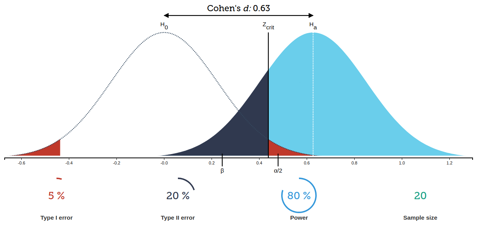

# Основы статистического вывода {-#stats}

## Запись занятия {-}

<iframe width="560" height="315" src="https://www.youtube.com/embed/xMI0EuPyfWc?si=BnvWfaeBdx7UaIDp" title="YouTube video player" frameborder="0" allow="accelerometer; autoplay; clipboard-write; encrypted-media; gyroscope; picture-in-picture; web-share" allowfullscreen></iframe>

## Основы стат.вывода {-}

## Выборка {-}

Выборка - часть генеральной совокупности

Выборочные статистики нельзя напрямую интерпретировать как характеристики генеральной совокупности. 

### Метрики центральных тенденций {-}

 - среднее: mean()
 
 - медиана: median()
 
 - мода (table() и другие методы оценки частот)

Например, выберем случайным образом 20 чисел из ряда от 1 до 100, и посчитаем метрики центральных тенденций ряда.


Надо помнить, что среднее менее устойчиво к отклонениям от нормального распределения, поэтому сравнение среднего и медианы может быть полезно для понимания данных, а медиана в целом более устойчивая к выбросам оценка.


### Метрики разброса {-}

 - размах: range()
 
 - дисперсия: var()
 
 - стандартное отклонение ($\sigma$): sd()

```r
range(x)
```

```
## [1]  4 93
```

```r
var(x)
```

```
## [1] 1031.671
```

```r
sd(x)
```

```
## [1] 32.11964
```

Обычно используют размах и стандартное отклонение. Стандартное отклонение понятнее дисперсии, потому что в тех же единицах, что и измерение, поэтому можно сказать $\overline{x} \pm \sigma$. В целом, стандартное отклонение служит метрикой "точности измерения" - чем выше дисперсия, тем менее точное измерение. Для большинства процессов характерно увеличение точности (снижение дисперсии) измерения с увеличением выборки - чем больше выборка, тем меньше дисперсия. Однако это правило неприменимо, в частности, к равномерному распределению и некоторым другим ситуациям (процессам с бесконечной дисперсией).

### Нормальное распределение {-}

Нормальным называется распределение вероятностей, которое для одномерного случая задаётся функцией Гаусса.

Нормальное распределение играет важнейшую роль во многих областях знаний. Случайная величина подчиняется нормальному закону распределения, когда она подвержена влиянию большого числа случайных факторов, что является типичной ситуацией в анализе данных. Поэтому нормальное распределение служит хорошей моделью для многих реальных процессов.


```{=html}
<div class="plotly html-widget html-fill-item-overflow-hidden html-fill-item" id="htmlwidget-d3b7c2e3fede5c798441" style="width:672px;height:480px;"></div>
<script type="application/json" data-for="htmlwidget-d3b7c2e3fede5c798441">{"x":{"visdat":{"85e102e3fe878":["function () ","plotlyVisDat"]},"cur_data":"85e102e3fe878","attrs":{"85e102e3fe878":{"x":{},"y":{},"mode":"lines","alpha_stroke":1,"sizes":[10,100],"spans":[1,20],"type":"scatter"}},"layout":{"margin":{"b":40,"l":60,"t":25,"r":10},"xaxis":{"domain":[0,1],"automargin":true,"title":"x"},"yaxis":{"domain":[0,1],"automargin":true,"title":"dnorm(x)"},"hovermode":"closest","showlegend":false},"source":"A","config":{"modeBarButtonsToAdd":["hoverclosest","hovercompare"],"showSendToCloud":false,"displayModeBar":false},"data":[{"x":[-5,-4.9900000000000002,-4.9800000000000004,-4.9699999999999998,-4.96,-4.9500000000000002,-4.9400000000000004,-4.9299999999999997,-4.9199999999999999,-4.9100000000000001,-4.9000000000000004,-4.8899999999999997,-4.8799999999999999,-4.8700000000000001,-4.8600000000000003,-4.8499999999999996,-4.8399999999999999,-4.8300000000000001,-4.8200000000000003,-4.8099999999999996,-4.7999999999999998,-4.79,-4.7800000000000002,-4.7699999999999996,-4.7599999999999998,-4.75,-4.7400000000000002,-4.7300000000000004,-4.7199999999999998,-4.71,-4.7000000000000002,-4.6900000000000004,-4.6799999999999997,-4.6699999999999999,-4.6600000000000001,-4.6500000000000004,-4.6399999999999997,-4.6299999999999999,-4.6200000000000001,-4.6100000000000003,-4.5999999999999996,-4.5899999999999999,-4.5800000000000001,-4.5700000000000003,-4.5599999999999996,-4.5499999999999998,-4.54,-4.5300000000000002,-4.5199999999999996,-4.5099999999999998,-4.5,-4.4900000000000002,-4.4800000000000004,-4.4699999999999998,-4.46,-4.4500000000000002,-4.4399999999999995,-4.4299999999999997,-4.4199999999999999,-4.4100000000000001,-4.4000000000000004,-4.3899999999999997,-4.3799999999999999,-4.3700000000000001,-4.3600000000000003,-4.3499999999999996,-4.3399999999999999,-4.3300000000000001,-4.3200000000000003,-4.3099999999999996,-4.2999999999999998,-4.29,-4.2800000000000002,-4.2699999999999996,-4.2599999999999998,-4.25,-4.2400000000000002,-4.2300000000000004,-4.2199999999999998,-4.21,-4.2000000000000002,-4.1899999999999995,-4.1799999999999997,-4.1699999999999999,-4.1600000000000001,-4.1500000000000004,-4.1399999999999997,-4.1299999999999999,-4.1200000000000001,-4.1100000000000003,-4.0999999999999996,-4.0899999999999999,-4.0800000000000001,-4.0700000000000003,-4.0599999999999996,-4.0499999999999998,-4.04,-4.0300000000000002,-4.0199999999999996,-4.0099999999999998,-4,-3.9900000000000002,-3.98,-3.9699999999999998,-3.96,-3.9500000000000002,-3.9399999999999999,-3.9299999999999997,-3.9199999999999999,-3.9100000000000001,-3.8999999999999999,-3.8899999999999997,-3.8799999999999999,-3.8700000000000001,-3.8599999999999999,-3.8499999999999996,-3.8399999999999999,-3.8300000000000001,-3.8200000000000003,-3.8100000000000001,-3.7999999999999998,-3.79,-3.7800000000000002,-3.77,-3.7599999999999998,-3.75,-3.7400000000000002,-3.73,-3.7199999999999998,-3.71,-3.7000000000000002,-3.6899999999999999,-3.6799999999999997,-3.6699999999999999,-3.6600000000000001,-3.6499999999999999,-3.6399999999999997,-3.6299999999999999,-3.6200000000000001,-3.6099999999999999,-3.5999999999999996,-3.5899999999999999,-3.5800000000000001,-3.5700000000000003,-3.5600000000000001,-3.5499999999999998,-3.54,-3.5300000000000002,-3.52,-3.5099999999999998,-3.5,-3.4900000000000002,-3.48,-3.4699999999999998,-3.46,-3.4500000000000002,-3.4399999999999999,-3.4299999999999997,-3.4199999999999999,-3.4100000000000001,-3.3999999999999999,-3.3899999999999997,-3.3799999999999999,-3.3700000000000001,-3.3599999999999999,-3.3499999999999996,-3.3399999999999999,-3.3300000000000001,-3.3200000000000003,-3.3100000000000001,-3.2999999999999998,-3.29,-3.2800000000000002,-3.27,-3.2599999999999998,-3.25,-3.2400000000000002,-3.23,-3.2199999999999998,-3.21,-3.2000000000000002,-3.1899999999999999,-3.1799999999999997,-3.1699999999999999,-3.1600000000000001,-3.1499999999999999,-3.1399999999999997,-3.1299999999999999,-3.1200000000000001,-3.1099999999999999,-3.0999999999999996,-3.0899999999999999,-3.0800000000000001,-3.0700000000000003,-3.0600000000000001,-3.0499999999999998,-3.04,-3.0300000000000002,-3.02,-3.0099999999999998,-3,-2.9899999999999998,-2.98,-2.9699999999999998,-2.96,-2.9500000000000002,-2.9399999999999999,-2.9300000000000002,-2.9199999999999999,-2.9100000000000001,-2.8999999999999999,-2.8900000000000001,-2.8799999999999999,-2.8700000000000001,-2.8599999999999999,-2.8500000000000001,-2.8399999999999999,-2.8300000000000001,-2.8199999999999998,-2.8100000000000001,-2.7999999999999998,-2.79,-2.7799999999999998,-2.77,-2.7599999999999998,-2.75,-2.7399999999999998,-2.73,-2.7199999999999998,-2.71,-2.6999999999999997,-2.6899999999999999,-2.6800000000000002,-2.6699999999999999,-2.6600000000000001,-2.6499999999999999,-2.6400000000000001,-2.6299999999999999,-2.6200000000000001,-2.6099999999999999,-2.6000000000000001,-2.5899999999999999,-2.5800000000000001,-2.5699999999999998,-2.5600000000000001,-2.5499999999999998,-2.54,-2.5299999999999998,-2.52,-2.5099999999999998,-2.5,-2.4899999999999998,-2.48,-2.4699999999999998,-2.46,-2.4499999999999997,-2.4399999999999999,-2.4300000000000002,-2.4199999999999999,-2.4100000000000001,-2.3999999999999999,-2.3900000000000001,-2.3799999999999999,-2.3700000000000001,-2.3599999999999999,-2.3500000000000001,-2.3399999999999999,-2.3300000000000001,-2.3199999999999998,-2.3100000000000001,-2.2999999999999998,-2.29,-2.2799999999999998,-2.27,-2.2599999999999998,-2.25,-2.2399999999999998,-2.23,-2.2199999999999998,-2.21,-2.1999999999999997,-2.1899999999999999,-2.1800000000000002,-2.1699999999999999,-2.1600000000000001,-2.1499999999999999,-2.1400000000000001,-2.1299999999999999,-2.1200000000000001,-2.1099999999999999,-2.1000000000000001,-2.0899999999999999,-2.0800000000000001,-2.0699999999999998,-2.0600000000000001,-2.0499999999999998,-2.04,-2.0299999999999998,-2.02,-2.0099999999999998,-2,-1.9899999999999998,-1.98,-1.9699999999999998,-1.96,-1.9499999999999997,-1.9399999999999999,-1.9299999999999997,-1.9199999999999999,-1.9100000000000001,-1.8999999999999999,-1.8900000000000001,-1.8799999999999999,-1.8700000000000001,-1.8599999999999999,-1.8500000000000001,-1.8399999999999999,-1.8300000000000001,-1.8199999999999998,-1.8100000000000001,-1.7999999999999998,-1.79,-1.7799999999999998,-1.77,-1.7599999999999998,-1.75,-1.7399999999999998,-1.73,-1.7199999999999998,-1.71,-1.6999999999999997,-1.6899999999999999,-1.6799999999999997,-1.6699999999999999,-1.6600000000000001,-1.6499999999999999,-1.6400000000000001,-1.6299999999999999,-1.6200000000000001,-1.6099999999999999,-1.6000000000000001,-1.5899999999999999,-1.5800000000000001,-1.5699999999999998,-1.5600000000000001,-1.5499999999999998,-1.54,-1.5299999999999998,-1.52,-1.5099999999999998,-1.5,-1.4899999999999998,-1.48,-1.4699999999999998,-1.46,-1.4499999999999997,-1.4399999999999999,-1.4299999999999997,-1.4199999999999999,-1.4100000000000001,-1.3999999999999999,-1.3900000000000001,-1.3799999999999999,-1.3700000000000001,-1.3599999999999999,-1.3500000000000001,-1.3399999999999999,-1.3300000000000001,-1.3199999999999998,-1.3100000000000001,-1.2999999999999998,-1.29,-1.2799999999999998,-1.27,-1.2599999999999998,-1.25,-1.2399999999999998,-1.23,-1.2199999999999998,-1.21,-1.1999999999999997,-1.1899999999999999,-1.1799999999999997,-1.1699999999999999,-1.1600000000000001,-1.1499999999999999,-1.1400000000000001,-1.1299999999999999,-1.1200000000000001,-1.1099999999999999,-1.1000000000000001,-1.0899999999999999,-1.0800000000000001,-1.0699999999999998,-1.0600000000000001,-1.0499999999999998,-1.04,-1.0299999999999998,-1.02,-1.0099999999999998,-1,-0.99000000000000021,-0.97999999999999954,-0.96999999999999975,-0.95999999999999996,-0.95000000000000018,-0.9399999999999995,-0.92999999999999972,-0.91999999999999993,-0.91000000000000014,-0.90000000000000036,-0.88999999999999968,-0.87999999999999989,-0.87000000000000011,-0.86000000000000032,-0.84999999999999964,-0.83999999999999986,-0.83000000000000007,-0.82000000000000028,-0.80999999999999961,-0.79999999999999982,-0.79000000000000004,-0.78000000000000025,-0.76999999999999957,-0.75999999999999979,-0.75,-0.74000000000000021,-0.72999999999999954,-0.71999999999999975,-0.70999999999999996,-0.70000000000000018,-0.6899999999999995,-0.67999999999999972,-0.66999999999999993,-0.66000000000000014,-0.64999999999999947,-0.63999999999999968,-0.62999999999999989,-0.62000000000000011,-0.61000000000000032,-0.59999999999999964,-0.58999999999999986,-0.58000000000000007,-0.57000000000000028,-0.55999999999999961,-0.54999999999999982,-0.54000000000000004,-0.53000000000000025,-0.51999999999999957,-0.50999999999999979,-0.5,-0.49000000000000021,-0.47999999999999954,-0.46999999999999975,-0.45999999999999996,-0.45000000000000018,-0.4399999999999995,-0.42999999999999972,-0.41999999999999993,-0.41000000000000014,-0.39999999999999947,-0.38999999999999968,-0.37999999999999989,-0.37000000000000011,-0.36000000000000032,-0.34999999999999964,-0.33999999999999986,-0.33000000000000007,-0.32000000000000028,-0.30999999999999961,-0.29999999999999982,-0.29000000000000004,-0.28000000000000025,-0.26999999999999957,-0.25999999999999979,-0.25,-0.24000000000000021,-0.22999999999999954,-0.21999999999999975,-0.20999999999999996,-0.20000000000000018,-0.1899999999999995,-0.17999999999999972,-0.16999999999999993,-0.16000000000000014,-0.14999999999999947,-0.13999999999999968,-0.12999999999999989,-0.12000000000000011,-0.11000000000000032,-0.099999999999999645,-0.089999999999999858,-0.080000000000000071,-0.070000000000000284,-0.059999999999999609,-0.049999999999999822,-0.040000000000000036,-0.030000000000000249,-0.019999999999999574,-0.0099999999999997868,0,0.0099999999999997868,0.020000000000000462,0.030000000000000249,0.040000000000000036,0.049999999999999822,0.060000000000000497,0.070000000000000284,0.080000000000000071,0.089999999999999858,0.10000000000000053,0.11000000000000032,0.12000000000000011,0.12999999999999989,0.13999999999999968,0.15000000000000036,0.16000000000000014,0.16999999999999993,0.17999999999999972,0.19000000000000039,0.20000000000000018,0.20999999999999996,0.21999999999999975,0.23000000000000043,0.24000000000000021,0.25,0.25999999999999979,0.27000000000000046,0.28000000000000025,0.29000000000000004,0.29999999999999982,0.3100000000000005,0.32000000000000028,0.33000000000000007,0.33999999999999986,0.35000000000000053,0.36000000000000032,0.37000000000000011,0.37999999999999989,0.38999999999999968,0.40000000000000036,0.41000000000000014,0.41999999999999993,0.42999999999999972,0.44000000000000039,0.45000000000000018,0.45999999999999996,0.46999999999999975,0.48000000000000043,0.49000000000000021,0.5,0.50999999999999979,0.52000000000000046,0.53000000000000025,0.54000000000000004,0.54999999999999982,0.5600000000000005,0.57000000000000028,0.58000000000000007,0.58999999999999986,0.60000000000000053,0.61000000000000032,0.62000000000000011,0.62999999999999989,0.63999999999999968,0.65000000000000036,0.66000000000000014,0.66999999999999993,0.67999999999999972,0.69000000000000039,0.70000000000000018,0.70999999999999996,0.71999999999999975,0.73000000000000043,0.74000000000000021,0.75,0.75999999999999979,0.77000000000000046,0.78000000000000025,0.79000000000000004,0.79999999999999982,0.8100000000000005,0.82000000000000028,0.83000000000000007,0.83999999999999986,0.85000000000000053,0.86000000000000032,0.87000000000000011,0.87999999999999989,0.88999999999999968,0.90000000000000036,0.91000000000000014,0.91999999999999993,0.92999999999999972,0.94000000000000039,0.95000000000000018,0.95999999999999996,0.96999999999999975,0.98000000000000043,0.99000000000000021,1,1.0099999999999998,1.0200000000000005,1.0300000000000002,1.04,1.0499999999999998,1.0600000000000005,1.0700000000000003,1.0800000000000001,1.0899999999999999,1.1000000000000005,1.1100000000000003,1.1200000000000001,1.1299999999999999,1.1400000000000006,1.1500000000000004,1.1600000000000001,1.1699999999999999,1.1799999999999997,1.1900000000000004,1.2000000000000002,1.21,1.2199999999999998,1.2300000000000004,1.2400000000000002,1.25,1.2599999999999998,1.2700000000000005,1.2800000000000002,1.29,1.2999999999999998,1.3100000000000005,1.3200000000000003,1.3300000000000001,1.3399999999999999,1.3500000000000005,1.3600000000000003,1.3700000000000001,1.3799999999999999,1.3900000000000006,1.4000000000000004,1.4100000000000001,1.4199999999999999,1.4299999999999997,1.4400000000000004,1.4500000000000002,1.46,1.4699999999999998,1.4800000000000004,1.4900000000000002,1.5,1.5099999999999998,1.5200000000000005,1.5300000000000002,1.54,1.5499999999999998,1.5600000000000005,1.5700000000000003,1.5800000000000001,1.5899999999999999,1.6000000000000005,1.6100000000000003,1.6200000000000001,1.6299999999999999,1.6400000000000006,1.6500000000000004,1.6600000000000001,1.6699999999999999,1.6799999999999997,1.6900000000000004,1.7000000000000002,1.71,1.7199999999999998,1.7300000000000004,1.7400000000000002,1.75,1.7599999999999998,1.7700000000000005,1.7800000000000002,1.79,1.7999999999999998,1.8100000000000005,1.8200000000000003,1.8300000000000001,1.8399999999999999,1.8500000000000005,1.8600000000000003,1.8700000000000001,1.8799999999999999,1.8900000000000006,1.9000000000000004,1.9100000000000001,1.9199999999999999,1.9299999999999997,1.9400000000000004,1.9500000000000002,1.96,1.9699999999999998,1.9800000000000004,1.9900000000000002,2,2.0099999999999998,2.0200000000000005,2.0300000000000002,2.04,2.0499999999999998,2.0600000000000005,2.0700000000000003,2.0800000000000001,2.0899999999999999,2.1000000000000005,2.1100000000000003,2.1200000000000001,2.1299999999999999,2.1400000000000006,2.1500000000000004,2.1600000000000001,2.1699999999999999,2.1799999999999997,2.1900000000000004,2.2000000000000002,2.21,2.2199999999999998,2.2300000000000004,2.2400000000000002,2.25,2.2599999999999998,2.2700000000000005,2.2800000000000002,2.29,2.2999999999999998,2.3100000000000005,2.3200000000000003,2.3300000000000001,2.3399999999999999,2.3500000000000005,2.3600000000000003,2.3700000000000001,2.3799999999999999,2.3900000000000006,2.4000000000000004,2.4100000000000001,2.4199999999999999,2.4299999999999997,2.4400000000000004,2.4500000000000002,2.46,2.4699999999999998,2.4800000000000004,2.4900000000000002,2.5,2.5099999999999998,2.5200000000000005,2.5300000000000002,2.54,2.5499999999999998,2.5600000000000005,2.5700000000000003,2.5800000000000001,2.5899999999999999,2.6000000000000005,2.6100000000000003,2.6200000000000001,2.6299999999999999,2.6400000000000006,2.6500000000000004,2.6600000000000001,2.6699999999999999,2.6799999999999997,2.6900000000000004,2.7000000000000002,2.71,2.7199999999999998,2.7300000000000004,2.7400000000000002,2.75,2.7599999999999998,2.7700000000000005,2.7800000000000002,2.79,2.7999999999999998,2.8100000000000005,2.8200000000000003,2.8300000000000001,2.8399999999999999,2.8500000000000005,2.8600000000000003,2.8700000000000001,2.8799999999999999,2.8900000000000006,2.9000000000000004,2.9100000000000001,2.9199999999999999,2.9300000000000006,2.9400000000000004,2.9500000000000002,2.96,2.9699999999999998,2.9800000000000004,2.9900000000000002,3,3.0099999999999998,3.0199999999999996,3.0299999999999994,3.0400000000000009,3.0500000000000007,3.0600000000000005,3.0700000000000003,3.0800000000000001,3.0899999999999999,3.0999999999999996,3.1099999999999994,3.120000000000001,3.1300000000000008,3.1400000000000006,3.1500000000000004,3.1600000000000001,3.1699999999999999,3.1799999999999997,3.1899999999999995,3.1999999999999993,3.2100000000000009,3.2200000000000006,3.2300000000000004,3.2400000000000002,3.25,3.2599999999999998,3.2699999999999996,3.2799999999999994,3.2900000000000009,3.3000000000000007,3.3100000000000005,3.3200000000000003,3.3300000000000001,3.3399999999999999,3.3499999999999996,3.3599999999999994,3.370000000000001,3.3800000000000008,3.3900000000000006,3.4000000000000004,3.4100000000000001,3.4199999999999999,3.4299999999999997,3.4399999999999995,3.4499999999999993,3.4600000000000009,3.4700000000000006,3.4800000000000004,3.4900000000000002,3.5,3.5099999999999998,3.5199999999999996,3.5299999999999994,3.5400000000000009,3.5500000000000007,3.5600000000000005,3.5700000000000003,3.5800000000000001,3.5899999999999999,3.5999999999999996,3.6099999999999994,3.620000000000001,3.6300000000000008,3.6400000000000006,3.6500000000000004,3.6600000000000001,3.6699999999999999,3.6799999999999997,3.6899999999999995,3.7000000000000011,3.7100000000000009,3.7200000000000006,3.7300000000000004,3.7400000000000002,3.75,3.7599999999999998,3.7699999999999996,3.7799999999999994,3.7900000000000009,3.8000000000000007,3.8100000000000005,3.8200000000000003,3.8300000000000001,3.8399999999999999,3.8499999999999996,3.8599999999999994,3.870000000000001,3.8800000000000008,3.8900000000000006,3.9000000000000004,3.9100000000000001,3.9199999999999999,3.9299999999999997,3.9399999999999995,3.9500000000000011,3.9600000000000009,3.9700000000000006,3.9800000000000004,3.9900000000000002,4,4.0099999999999998,4.0199999999999996,4.0299999999999994,4.0400000000000009,4.0500000000000007,4.0600000000000005,4.0700000000000003,4.0800000000000001,4.0899999999999999,4.0999999999999996,4.1099999999999994,4.120000000000001,4.1300000000000008,4.1400000000000006,4.1500000000000004,4.1600000000000001,4.1699999999999999,4.1799999999999997,4.1899999999999995,4.2000000000000011,4.2100000000000009,4.2200000000000006,4.2300000000000004,4.2400000000000002,4.25,4.2599999999999998,4.2699999999999996,4.2799999999999994,4.2900000000000009,4.3000000000000007,4.3100000000000005,4.3200000000000003,4.3300000000000001,4.3399999999999999,4.3499999999999996,4.3599999999999994,4.370000000000001,4.3800000000000008,4.3900000000000006,4.4000000000000004,4.4100000000000001,4.4199999999999999,4.4299999999999997,4.4399999999999995,4.4500000000000011,4.4600000000000009,4.4700000000000006,4.4800000000000004,4.4900000000000002,4.5,4.5099999999999998,4.5199999999999996,4.5299999999999994,4.5400000000000009,4.5500000000000007,4.5600000000000005,4.5700000000000003,4.5800000000000001,4.5899999999999999,4.5999999999999996,4.6099999999999994,4.620000000000001,4.6300000000000008,4.6400000000000006,4.6500000000000004,4.6600000000000001,4.6699999999999999,4.6799999999999997,4.6899999999999995,4.7000000000000011,4.7100000000000009,4.7200000000000006,4.7300000000000004,4.7400000000000002,4.75,4.7599999999999998,4.7699999999999996,4.7799999999999994,4.7900000000000009,4.8000000000000007,4.8100000000000005,4.8200000000000003,4.8300000000000001,4.8399999999999999,4.8499999999999996,4.8599999999999994,4.870000000000001,4.8800000000000008,4.8900000000000006,4.9000000000000004,4.9100000000000001,4.9199999999999999,4.9299999999999997,4.9399999999999995,4.9500000000000011,4.9600000000000009,4.9700000000000006,4.9800000000000004,4.9900000000000002,5],"y":[1.4867195147342977e-06,1.5628671089492902e-06,1.6427505880450713e-06,1.7265445216770734e-06,1.8144311901820303e-06,1.9066009031228108e-06,2.0032523299484894e-06,2.1045928431831295e-06,2.2108388745684212e-06,2.322216284597997e-06,2.4389607458933522e-06,2.5613181408845443e-06,2.6895449742715233e-06,2.823908800755821e-06,2.964688668545273e-06,3.1121755791489445e-06,3.2666729639932752e-06,3.4284971784050389e-06,3.5979780135212474e-06,3.775459226701349e-06,3.9612990910320753e-06,4.1558709645312011e-06,4.3595638796716367e-06,4.5727831538641446e-06,4.7959510215525217e-06,5.0295072885924454e-06,5.2739100096013034e-06,5.5296361889840515e-06,5.797182506357287e-06,6.0770660671111151e-06,6.3698251788670899e-06,6.6760201546074609e-06,6.996234143270405e-06,7.3310739886239449e-06,7.6811711172504553e-06,8.0471824564922952e-06,8.4297913832287717e-06,8.8297087043740978e-06,9.2476736700056167e-06,9.684455020051437e-06,1.0140852065486758e-05,1.0617695805008393e-05,1.111585007817779e-05,1.1636212756042667e-05,1.2179716970268699e-05,1.2747332381833466e-05,1.334006649035584e-05,1.3958965985154772e-05,1.4605118139152942e-05,1.527965224676162e-05,1.5983741106905475e-05,1.6718602552365071e-05,1.7485501026639135e-05,1.828574920954738e-05,1.9120709692817737e-05,1.9991796706922791e-05,2.0900477900450482e-05,2.184827617331647e-05,2.283677156514692e-05,2.3867603200179601e-05,2.4942471290053535e-05,2.6063139195878342e-05,2.7231435550992609e-05,2.8449256445844305e-05,2.9718567676442199e-05,3.1041407057850266e-05,3.2419886804213778e-05,3.3856195976827888e-05,3.5352603001773097e-05,3.6911458258666195e-05,3.8535196742087129e-05,4.0226340797264972e-05,4.1987502931617321e-05,4.3821388703758118e-05,4.5730799691601314e-05,4.7718636541204952e-05,4.978790209801209e-05,5.1941704622159769e-05,5.4183261089540144e-05,5.6515900580307407e-05,5.8943067756539855e-05,6.1468326430769434e-05,6.4095363227106096e-05,6.6827991336690609e-05,6.9670154369214326e-05,7.2625930302252324e-05,7.5699535530161213e-05,7.8895329014293087e-05,8.2217816536286003e-05,8.5671655056181864e-05,8.9261657177132928e-05,9.2992795718445907e-05,9.687020839871926e-05,0.00010089920263081441,0.00010508526043040047,0.00010943404343980055,0.00011395139806886461,0.00011864336075456578,0.00012351616334102368,0.00012857623858162108,0.00013383022576488537,0.00013928497646575994,0.00014494756042389106,0.00015082527155051807,0.00015692563406553226,0.00016325640876624199,0.00016982559942934359,0.00017664145934757122,0.00018371249800245711,0.00019104748787459762,0.00019865547139277272,0.00020654576802322586,0.00021472798150036704,0.00022321200720010206,0.00023200803965694238,0.00024112658022599367,0.00025057844489086075,0.00026037477221844247,0.00027052703146152073,0.00028104703080998632,0.00029194692579146027,0.00030323922782200417,0.00031493681290752155,0.00032705293049637498,0.00033960121248365478,0.00035259568236744541,0.00036605076455733496,0.00037998129383532141,0.00039440252496915693,0.00040933014247807883,0.00042478027055075143,0.00044076948311513252,0.00045731481405985762,0.00047443376760662064,0.00049214432883289312,0.0005104649743441856,0.00052941468309493562,0.0005490129473569587,0.00056927978383425261,0.00059023574492278561,0.00061190193011377298,0.0006342999975387576,0.00065745217565467645,0.00068138127506689147,0.0007061107004880362,0.00073166446283031089,0.0007580671914287103,0.00078534414639246856,0.00081352123108180841,0.00084262500470690268,0.00087268269504576015,0.00090372221127752448,0.00093577215692747977,0.00096886184291984678,0.0010030213007342376,0.0010382812956614103,0.0010746733401537356,0.001112229707265567,0.0011509834441784845,0.0011909683858061166,0.0012322191684730199,0.0012747712436618351,0.0013186608918227423,0.0013639252362389036,0.0014106022569413848,0.0014587308046667472,0.0015083506148503073,0.0015595023216476915,0.0016122274719771231,0.0016665685395745797,0.0017225689390536812,0.0017802730399618786,0.0018397261808242775,0.0019009746831660803,0.0019640658655043761,0.0020290480572997681,0.0020959706128579419,0.002164883925171062,0.0022358394396885424,0.0023088896680064958,0.0023840882014648404,0.0024614897246407006,0.0025411500287265262,0.0026231260247810244,0.0027074757568406999,0.0027942584148794472,0.0028835343476034414,0.0029753650750682535,0.0030698133011047403,0.0031669429255400811,0.0032668190561999247,0.0033695080206774812,0.0034750773778549375,0.0035835959291623588,0.0036951337295590349,0.0038097620982218104,0.0039275536289247789,0.0040485822000944265,0.0041729229845239623,0.0043006524587304498,0.0044318484119380075,0.0045665899546701487,0.0047049575269339792,0.0048470329059789527,0.0049928992136123763,0.0051426409230539392,0.0052963438653110201,0.0054540952350565454,0.005615983595990969,0.0057820988856694729,0.0059525324197758538,0.0061273768958236873,0.0063067263962659275,0.0064906763909933643,0.0066793237392026202,0.0068727666906139712,0.0070711048860194487,0.0072744393571412182,0.0074828725257805638,0.0076965082022373218,0.0079154515829799686,0.0081398092475460215,0.008369689154653033,0.0086052006374996715,0.0088464543982372315,0.0090935625015910529,0.0093466383676122922,0.0096057967635395872,0.0098711537947511439,0.010142826894787077,0.010420934814422605,0.010705597609772187,0.010996936629405572,0.011295074500456135,0.011600135113702561,0.011912243607605179,0.012231526351277971,0.012558110926378211,0.012892126107895304,0.013233701843821374,0.013582969233685613,0.013940060505935825,0.01430510899414969,0.014678249112060044,0.015059616327377449,0.015449347134395174,0.015847579025360818,0.016254450460600506,0.016670100837381057,0.017094670457496956,0.01752830049356854,0.01797113295403965,0.018423310646862048,0.018884977141856187,0.019356276731736961,0.019837354391795337,0.020328355738225837,0.020829426985092186,0.021340714899922782,0.021862366757929387,0.022394530294842899,0.022937353658360693,0.023490985358201363,0.024055574214762971,0.024631269306382507,0.025218219915194382,0.02581657547158769,0.026426485497261721,0.027048099546881785,0.027681567148336573,0.028327037741601186,0.028984660616209412,0.029654584847341278,0.030336959230531636,0.03103193221500827,0.031739651835667418,0.032460265643697472,0.033193920635861122,0.033940763182449214,0.03470093895391882,0.035474592846231459,0.036261868904906222,0.037062910247806474,0.037877858986677483,0.038706856147455608,0.03955004158937022,0.040407553922860308,0.041279530426330417,0.042166106961770311,0.043067417889265734,0.043983595980427191,0.0449147723307671,0.045861076271054887,0.046822635277683163,0.047799574882077034,0.048792018579182764,0.049800087735070775,0.050823901493691204,0.051863576682820565,0.052919227719240312,0.053990966513188063,0.055078902372125788,0.056183141903868049,0.057303788919117152,0.058440944333451469,0.05959470606881611,0.060765168954564776,0.061952424628105192,0.063156561435198655,0.064377664329969345,0.065615814774676595,0.066871090639307143,0.068143566101044578,0.069433311543674187,0.070740393456983394,0.072064874336217985,0.073406812581656919,0.074766262398367603,0.076143273696207353,0.077537891990133986,0.078950158300894177,0.08038010905615417,0.081827775992142845,0.083293186055874463,0.084776361308022255,0.086277318826511532,0.087796070610905663,0.089332623487655,0.090886979016282898,0.092459133396580684,0.094049077376886975,0.095656796163524016,0.097282269331467539,0.098925470736323712,0.10058636842769055,0.10226492456397804,0.10396109532876419,0.10567483084876363,0.1074060751134838,0.1091547658966474,0.11092083467945554,0.1127042065757706,0.11450480025929236,0.11632252789280711,0.11815729505958227,0.12000900069698565,0.12187753703240178,0.12376278952152316,0.12566463678908815,0.12758295057214192,0.12951759566589174,0.13146842987223106,0.13343530395100231,0.13541806157407132,0.13741653928228179,0.13943056644536031,0.14145996522483878,0.14350455054006248,0.14556413003734761,0.14763850406235568,0.14972746563574488,0.15183080043216163,0.15394828676263372,0.15607969556042084,0.15822479037038306,0.1603833273419196,0.16255505522553418,0.1647397153730768,0.16693704174171387,0.16914676090167238,0.17136859204780741,0.17360224701503299,0.17584743029766242,0.17810383907269359,0.18037116322708038,0.18264908538902191,0.18493728096330536,0.18723541817072956,0.1895431580916403,0.19186015471359938,0.19418605498321304,0.19652049886213654,0.19886311938727594,0.2012135427351974,0.20357138829075938,0.20593626871997478,0.20830779004710831,0.21068555173601533,0.21306914677571784,0.21545816177021973,0.21785217703255053,0.22025076668303334,0.22265349875176113,0.22505993528526971,0.22746963245738591,0.2298821406842331,0.2322970047433662,0.23471376389701187,0.23713195201937959,0.23955109772801339,0.24197072451914337,0.24439035090699954,0.24680949056704282,0.249227652483066,0.25164434109811712,0.25405905646918897,0.2564712944256205,0.25888054673114891,0.26128630124955315,0.26368804211381813,0.26608524989875476,0.26847740179700241,0.27086397179833804,0.27324443087221623,0.27561824715345662,0.27798488613099659,0.28034381083962062,0.28269448205458025,0.28503635848900716,0.2873688969940284,0.28969155276148278,0.29200377952914142,0.29430502978832507,0.29659475499381582,0.29887240577595287,0.30113743215480443,0.30338928375630009,0.30562741003020999,0.30785126046985301,0.31006028483341613,0.31225393336676122,0.3144316570275974,0.31659290771089288,0.31873713847540158,0.32086380377117246,0.32297235966791443,0.32506226408408218,0.32713297701655447,0.32918396077076478,0.33121468019115285,0.33322460289179973,0.33521319948710615,0.33717994382238053,0.33912431320419212,0.34104578863035268,0.3429438550193839,0.34481800143933333,0.3466677213357916,0.34849251275897458,0.35029187858972588,0.35206532676429952,0.35381237049777964,0.35553252850599715,0.35722532522580086,0.35889029103354464,0.36052696246164795,0.36213488241309233,0.36371360037371347,0.36526267262215389,0.36678166243733612,0.36827014030332339,0.36972768411143242,0.37115387935946603,0.37254831934793342,0.37391060537312837,0.37524034691693797,0.37653716183325397,0.37780067653086458,0.37903052615270166,0.38022635475132499,0.38138781546052414,0.38251457066292405,0.38360629215347852,0.38466266129874283,0.38568336919181612,0.38666811680284924,0.38761661512501411,0.38852858531583595,0.38940375883379047,0.39024187757007428,0.39104269397545588,0.39180597118212113,0.39253148312042896,0.39321901463049719,0.39386836156854083,0.39447933090788895,0.39505174083461131,0.39558542083768738,0.3960802117936561,0.39653596604568575,0.39695254747701181,0.39732983157868834,0.39766770551160885,0.39796606816275104,0.39822483019560695,0.39844391409476404,0.39862325420460504,0.39876279676209969,0.39886249992366613,0.39892233378608216,0.3989422804014327,0.39892233378608216,0.39886249992366613,0.39876279676209969,0.39862325420460504,0.39844391409476404,0.39822483019560689,0.39796606816275104,0.39766770551160885,0.39732983157868834,0.39695254747701175,0.39653596604568575,0.3960802117936561,0.39558542083768738,0.39505174083461131,0.39447933090788889,0.39386836156854083,0.39321901463049719,0.39253148312042896,0.39180597118212107,0.39104269397545588,0.39024187757007428,0.38940375883379047,0.38852858531583589,0.38761661512501411,0.38666811680284924,0.38568336919181612,0.38466266129874277,0.38360629215347852,0.38251457066292405,0.38138781546052414,0.38022635475132488,0.37903052615270166,0.37780067653086458,0.37653716183325397,0.37524034691693781,0.37391060537312837,0.37254831934793342,0.37115387935946603,0.36972768411143242,0.36827014030332328,0.36678166243733612,0.36526267262215389,0.36371360037371347,0.36213488241309216,0.36052696246164795,0.35889029103354464,0.35722532522580086,0.35553252850599704,0.35381237049777964,0.35206532676429952,0.35029187858972588,0.34849251275897447,0.3466677213357916,0.34481800143933333,0.3429438550193839,0.34104578863035245,0.33912431320419212,0.33717994382238053,0.33521319948710615,0.33322460289179956,0.33121468019115285,0.32918396077076478,0.32713297701655447,0.32506226408408218,0.32297235966791421,0.32086380377117246,0.31873713847540158,0.31659290771089288,0.31443165702759723,0.31225393336676122,0.31006028483341613,0.30785126046985301,0.30562741003020982,0.30338928375630009,0.30113743215480443,0.29887240577595287,0.29659475499381566,0.29430502978832507,0.29200377952914142,0.28969155276148278,0.28736889699402818,0.28503635848900716,0.28269448205458025,0.28034381083962062,0.27798488613099637,0.27561824715345662,0.27324443087221623,0.27086397179833804,0.26847740179700241,0.26608524989875476,0.26368804211381813,0.26128630124955315,0.25888054673114891,0.25647129442562028,0.25405905646918897,0.25164434109811712,0.249227652483066,0.24680949056704266,0.24439035090699954,0.24197072451914337,0.23955109772801339,0.23713195201937948,0.23471376389701173,0.2322970047433662,0.2298821406842331,0.22746963245738577,0.22505993528526957,0.22265349875176113,0.22025076668303334,0.21785217703255041,0.21545816177021965,0.21306914677571784,0.21068555173601533,0.20830779004710823,0.20593626871997464,0.20357138829075938,0.2012135427351974,0.19886311938727594,0.19652049886213643,0.19418605498321292,0.19186015471359938,0.1895431580916403,0.18723541817072945,0.18493728096330525,0.18264908538902191,0.18037116322708038,0.17810383907269348,0.17584743029766231,0.17360224701503299,0.17136859204780741,0.1691467609016723,0.16693704174171375,0.1647397153730768,0.16255505522553418,0.16038332734191951,0.15822479037038298,0.15607969556042084,0.15394828676263372,0.15183080043216157,0.14972746563574479,0.14763850406235568,0.14556413003734761,0.14350455054006248,0.1414599652248387,0.13943056644536023,0.13741653928228179,0.13541806157407132,0.1334353039510022,0.13146842987223098,0.12951759566589174,0.12758295057214192,0.12566463678908804,0.12376278952152307,0.12187753703240178,0.12000900069698565,0.11815729505958221,0.11632252789280702,0.11450480025929236,0.1127042065757706,0.11092083467945546,0.10915476589664731,0.1074060751134838,0.10567483084876363,0.1039610953287641,0.10226492456397797,0.10058636842769055,0.098925470736323712,0.097282269331467539,0.095656796163523933,0.094049077376886905,0.092459133396580684,0.090886979016282898,0.08933262348765493,0.087796070610905594,0.086277318826511532,0.084776361308022255,0.083293186055874407,0.081827775992142762,0.08038010905615417,0.078950158300894177,0.077537891990133917,0.076143273696207284,0.074766262398367603,0.073406812581656919,0.072064874336217916,0.070740393456983339,0.069433311543674187,0.068143566101044578,0.066871090639307074,0.065615814774676554,0.064377664329969345,0.063156561435198655,0.061952424628105192,0.060765168954564734,0.059594706068816054,0.058440944333451469,0.057303788919117152,0.056183141903867993,0.055078902372125739,0.053990966513188063,0.052919227719240312,0.05186357668282051,0.050823901493691162,0.049800087735070775,0.048792018579182764,0.047799574882076964,0.046822635277683121,0.045861076271054887,0.0449147723307671,0.043983595980427156,0.043067417889265699,0.042166106961770311,0.041279530426330417,0.040407553922860252,0.039550041589370186,0.038706856147455608,0.037877858986677483,0.037062910247806502,0.036261868904906187,0.035474592846231424,0.03470093895391882,0.033940763182449214,0.033193920635861088,0.032460265643697445,0.031739651835667418,0.03103193221500827,0.030336959230531597,0.02965458484734125,0.028984660616209412,0.028327037741601186,0.027681567148336531,0.027048099546881761,0.026426485497261721,0.02581657547158769,0.025218219915194361,0.024631269306382486,0.024055574214762971,0.023490985358201363,0.022937353658360662,0.022394530294842882,0.021862366757929387,0.021340714899922782,0.020829426985092204,0.02032835573822582,0.019837354391795313,0.019356276731736961,0.018884977141856187,0.018423310646862031,0.017971132954039633,0.01752830049356854,0.017094670457496956,0.016670100837381043,0.016254450460600492,0.015847579025360818,0.015449347134395174,0.01505961632737743,0.014678249112060025,0.01430510899414969,0.013940060505935825,0.013582969233685602,0.013233701843821355,0.012892126107895304,0.012558110926378211,0.012231526351277954,0.011912243607605169,0.011600135113702561,0.011295074500456135,0.010996936629405587,0.010705597609772173,0.010420934814422592,0.010142826894787077,0.0098711537947511439,0.0096057967635395751,0.0093466383676122835,0.0090935625015910529,0.0088464543982372315,0.008605200637499661,0.0083696891546530226,0.0081398092475460215,0.0079154515829799686,0.0076965082022373114,0.0074828725257805526,0.0072744393571412182,0.0070711048860194487,0.0068727666906139651,0.0066793237392026089,0.0064906763909933643,0.0063067263962659275,0.0061273768958236769,0.0059525324197758486,0.0057820988856694729,0.005615983595990969,0.005454095235056541,0.0052963438653110097,0.0051426409230539392,0.0049928992136123763,0.0048470329059789527,0.0047049575269339713,0.0045665899546701444,0.0044318484119380075,0.0043006524587304498,0.0041729229845239657,0.0040485822000944369,0.0039275536289247685,0.0038097620982218,0.0036951337295590284,0.0035835959291623588,0.0034750773778549375,0.0033695080206774812,0.0032668190561999247,0.0031669429255400841,0.0030698133011047325,0.0029753650750682457,0.002883534347603434,0.002794258414879442,0.0027074757568406999,0.0026231260247810244,0.0025411500287265262,0.0024614897246407049,0.0023840882014648486,0.0023088896680064893,0.0022358394396885346,0.0021648839251710585,0.0020959706128579419,0.0020290480572997681,0.0019640658655043761,0.001900974683166082,0.0018397261808242825,0.0017802730399618721,0.0017225689390536767,0.0016665685395745784,0.0016122274719771231,0.0015595023216476915,0.0015083506148503073,0.0014587308046667472,0.0014106022569413861,0.0013639252362389,0.0013186608918227375,0.0012747712436618306,0.0012322191684730175,0.0011909683858061166,0.0011509834441784845,0.001112229707265567,0.0010746733401537367,0.001038281295661414,0.0010030213007342348,0.00096886184291984417,0.00093577215692747804,0.00090372221127752448,0.00087268269504576015,0.00084262500470690268,0.00081352123108180917,0.00078534414639247127,0.00075806719142870824,0.00073166446283030894,0.00070611070048803501,0.00068138127506689147,0.00065745217565467645,0.0006342999975387576,0.00061190193011377298,0.00059023574492278658,0.00056927978383425066,0.00054901294735695719,0.00052941468309493378,0.00051046497434418473,0.00049214432883289312,0.00047443376760662064,0.00045731481405985762,0.00044076948311513327,0.00042478027055074997,0.00040933014247807736,0.00039440252496915552,0.00037998129383532076,0.00036605076455733496,0.00035259568236744541,0.00033960121248365478,0.0003270529304963753,0.00031493681290752236,0.00030323922782200309,0.00029194692579145951,0.00028104703080998584,0.00027052703146152073,0.00026037477221844247,0.00025057844489086075,0.00024112658022599367,0.00023200803965694276,0.0002232120072001013,0.00021472798150036626,0.00020654576802322513,0.00019865547139277237,0.00019104748787459762,0.00018371249800245711,0.00017664145934757122,0.00016982559942934388,0.00016325640876624142,0.00015692563406553169,0.00015082527155051753,0.00014494756042389079,0.00013928497646575994,0.00013383022576488537,0.00012857623858162108,0.00012351616334102368,0.00011864336075456619,0.00011395139806886421,0.00010943404343980016,0.00010508526043040011,0.00010089920263081441,9.687020839871926e-05,9.2992795718445907e-05,8.9261657177132928e-05,8.5671655056182163e-05,8.2217816536285556e-05,7.8895329014292803e-05,7.5699535530160942e-05,7.2625930302252324e-05,6.9670154369214326e-05,6.6827991336690609e-05,6.4095363227106096e-05,6.1468326430769434e-05,5.8943067756539645e-05,5.6515900580307204e-05,5.4183261089539955e-05,5.1941704622159769e-05,4.978790209801209e-05,4.7718636541204952e-05,4.5730799691601314e-05,4.3821388703758118e-05,4.1987502931617464e-05,4.0226340797264829e-05,3.8535196742086994e-05,3.6911458258666067e-05,3.5352603001773097e-05,3.3856195976827888e-05,3.2419886804213778e-05,3.1041407057850266e-05,2.9718567676442307e-05,2.8449256445844203e-05,2.723143555099251e-05,2.6063139195878251e-05,2.4942471290053535e-05,2.3867603200179601e-05,2.283677156514692e-05,2.184827617331647e-05,2.0900477900450482e-05,1.999179670692272e-05,1.9120709692817669e-05,1.8285749209547312e-05,1.7485501026639135e-05,1.6718602552365071e-05,1.5983741106905475e-05,1.527965224676162e-05,1.4605118139152942e-05,1.3958965985154821e-05,1.3340066490355767e-05,1.2747332381833396e-05,1.2179716970268655e-05,1.1636212756042667e-05,1.111585007817779e-05,1.0617695805008393e-05,1.0140852065486758e-05,9.6844550200514709e-06,9.2476736700055675e-06,8.8297087043740503e-06,8.4297913832287412e-06,8.0471824564922952e-06,7.6811711172504553e-06,7.3310739886239449e-06,6.996234143270405e-06,6.6760201546074854e-06,6.3698251788670679e-06,6.0770660671110939e-06,5.7971825063572667e-06,5.5296361889840515e-06,5.2739100096013034e-06,5.0295072885924454e-06,4.7959510215525217e-06,4.5727831538641446e-06,4.3595638796716519e-06,4.155870964531179e-06,3.9612990910320609e-06,3.7754592267013287e-06,3.5979780135212474e-06,3.4284971784050389e-06,3.2666729639932752e-06,3.1121755791489445e-06,2.9646886685452831e-06,2.8239088007558108e-06,2.6895449742715136e-06,2.5613181408845308e-06,2.4389607458933522e-06,2.322216284597997e-06,2.2108388745684212e-06,2.1045928431831295e-06,2.0032523299485e-06,1.9066009031228006e-06,1.814431190182024e-06,1.7265445216770643e-06,1.6427505880450713e-06,1.5628671089492902e-06,1.4867195147342977e-06],"mode":"lines","type":"scatter","marker":{"color":"rgba(31,119,180,1)","line":{"color":"rgba(31,119,180,1)"}},"error_y":{"color":"rgba(31,119,180,1)"},"error_x":{"color":"rgba(31,119,180,1)"},"line":{"color":"rgba(31,119,180,1)"},"xaxis":"x","yaxis":"y","frame":null}],"highlight":{"on":"plotly_click","persistent":false,"dynamic":false,"selectize":false,"opacityDim":0.20000000000000001,"selected":{"opacity":1},"debounce":0},"shinyEvents":["plotly_hover","plotly_click","plotly_selected","plotly_relayout","plotly_brushed","plotly_brushing","plotly_clickannotation","plotly_doubleclick","plotly_deselect","plotly_afterplot","plotly_sunburstclick"],"base_url":"https://plot.ly"},"evals":[],"jsHooks":[]}</script>
```

Основные функции для работы с распределениями:

 - d*() --- функция вероятности (probability mass function) для дискретных распределений и функция плотности вероятности для непрерывных распределений. В практике аналитиков используется редко, нужна для понимания и визуализации теоретической формы распределения при разных параметрах.
 
 - p*() --- функция накопленной плотности распределения (cumulative distribution function; cdf), позволяет получить накопленную вероятность получить такое значение при условии, что оно принадлежит указанному распределению. Другими словами, с помощью этой функции можно получить вероятность получить такое значение или меньшее. Например, мы знаем, что в популяции средний мужчин распределен приблизительно нормально, со средним ростом $\overline{M}$ = 170 и $\sigma$ = 10. Попробуем понять, какова будет вероятность встретить человека с ростом 180 см или выше:


```r
pnorm(q = 180, mean = 170, sd = 10)
```

```
## [1] 0.8413447
```
 
Мы получаем значение 0.8413 - так как `pnorm()` использует функцию накопленной плотности, то это вероятность получить значение **меньше** 180 (то есть, 84% встреченных людей будет ниже 180 см.). Для того, чтобы оценить вероятность встретить значения больше, чем указанное (в нашем примере --- встретить человека выше 180 см.) необходимо либо вычесть из единицы, либо воспользоваться аргументом `lower.tail`:

```r
1 - pnorm(q = 180, mean = 170, sd = 10)
```

```
## [1] 0.1586553
```

```r
pnorm(q = 180, mean = 170, sd = 10, lower.tail = FALSE)
```

```
## [1] 0.1586553
```

 - q*() --- квантильная функция (quantile function) или обратная функция накопленной плотности распределения (inverse cumulative distribution function), позволяет получить значение исходя из квантиля накопленной плотности распределения. Таким образом, если следовать примеру с ростом людей в популяции, мы можем оценить, какова будет вероятность встретить людей из, допустим, верхнего квартиля (с какого роста можно говорить, что этот человек входит 25% самых высоких людей популяции):
 

```r
qnorm(p = 0.75, mean = 170, sd = 10)
```

```
## [1] 176.7449
```

Таким образом, если встреченный человек выше 176.74 см., то он выше чем 3/4 всех людей популяции.

- r*() --- используется для генерации семплов из распределения определенной формы и с заданными параметрами. Например, генерируем семпл из нормального распределения:

```r
# генерируем данные сразу из стандартного нормального распределения
x <- rnorm(1000, mean = 0, sd = 1)
x[1:10]
```

```
##  [1]  0.9594941 -0.1102855 -0.5110095 -0.9111954 -0.8371717  2.4158352
##  [7]  0.1340882 -0.4906859 -0.4405479  0.4595894
```

C помощью `rnorm()` делаются выборки из распределения с заданными параметрами, однако чем меньше выборка, тем сильнее эмпирические значения среднего и стандартного отклонения будут отличаться от заданных при генерации:

```r
# мы задвали 0
mean(x)
```

```
## [1] -0.02189492
```

```r
# мы задавали 1
sd(x)
```

```
## [1] 0.9992201
```


Префиксы `p`, `r`, `d`, `q` используются не только для нормального распределения (`-norm()`), в частности, для `t`-распределения, логнормального (`-lnorm`), равномерного (`-unif`) и т. д.

### Z-преобразование {-}
Преобразование (его иногда называют нормализацией), которое приводит нормально распределенные данные с произвольным средним и стандартным отклонением к стандартному нормальному распределению с $\overline{M}$ = 0 и $\sigma$ = 1:

$$z = \frac{X_i-\overline{M}}{\sigma}$$


```r
x <- 1:10
scale(x)
```

```
##             [,1]
##  [1,] -1.4863011
##  [2,] -1.1560120
##  [3,] -0.8257228
##  [4,] -0.4954337
##  [5,] -0.1651446
##  [6,]  0.1651446
##  [7,]  0.4954337
##  [8,]  0.8257228
##  [9,]  1.1560120
## [10,]  1.4863011
## attr(,"scaled:center")
## [1] 5.5
## attr(,"scaled:scale")
## [1] 3.02765
```

Нормализация данных нужна в ситуациях, когда надо сравнивать выборки и распределений с разными параметрами или когда надо все измерения привести к одному масштабу. Допустим, у нас есть две выборки. Сравнивать распределение данных между выборками достаточно сложно, поэтому обычно сначала нормализуют, а потом сравнивают. Точно также нормализовать данные необходимо в некоторых алгоритмах типа кластерного анализа, чтобы масштаб измерения не вносил дополнительные эффекты.


### Проверка гипотез. NHST {-}

В классической статистике проверяется гипотеза, что группы не различаются (что разница средних равна нулю с высокой вероятностью, как в t-тесте). Концепция p-value исходит из этих условий --- оценивается, насколько вероятно получить такое значение или б*о*льшие различия. И если вероятность невысока (обычно за порог берется 5%, 0.05), то делается вывод, что вероятность нулевой разницы групп низкая и можно считать, что группы различаются.

$H_0: \overline{M_1} = \overline{M_2}$

Если формально, то **p-value:--- вероятность получить такие или более экстремальные значения при условии, что $H_0$ истинна**. 


### Тестовые статистики и распределения {-}
Все критерии сравнения групп --- это поиск какой-то метрики, по которой можно оценить степень различия. Это может быть как разница средних, так и соотношение групповой и межгрупповой дисперсий, и степень отклонения наблюдаемой вероятности от ожидаемой, и прочие метрики. Притом эти значения различия могут быть описаны разными (каждое своим) теоретическими распределениями:

*t*, *t-test*, *t.test()*: сравнение средних значений групп

*F*, *ANOVA*: сравнение внутригрупповой и межгрупповой дисперсий

$\chi^2$, *ci-square test*, *prop.test()*: сравнение вероятностей в дискретных (биномиальном) распределениях

В критериях вычисляется эта разница и нормируется на совокупную дисперсию групп (своеобразное z-преобразование), и потом вычисляется вероятность получить такую разницу (p-value).

Допустим, у нас есть две группы: мужчины ($\overline{M}$ = 175, $\sigma$ = 10) и женщины ($\overline{M}$ = 165, $\sigma$ = 10):

```r
x_m <- rnorm(25, mean = 175, sd = 10)
x_f <- rnorm(25, mean = 165, sd = 10)
```

Мы хотим понять, значимо ли это различие между двумя группами или нет. Для этого мы формулируем нулевую гипотезу, которую и проверяем статистическими критериями: нулевая гипотеза всегда о том, что различий между группами нет. Мы никогда не можем принять гипотезу (потому что мы имеем дело с выборками, мало ли что попадется в других выборках), мы можем только найти существенные аргументы, чтобы ее отвергнуть. 

Таким аргументом будет оценка вероятность получить такое различие между группами, какое мы наблюдаем на наших выборках, при предположении, что различий нет (равны нулю). То есть мы обращаемся к теоретическому распределению меры различий, в котором математическое ожидание (среднее для нормального распределения) равно нулю и на этом распределении оцениваем, какова вероятность получить то значение, которое мы получили на наших выборках.

Один из самый простых тестов для сравнения групп --- [критерий Стьюдента](https://ru.wikipedia.org/wiki/T-%D0%BA%D1%80%D0%B8%D1%82%D0%B5%D1%80%D0%B8%D0%B9_%D0%A1%D1%82%D1%8C%D1%8E%D0%B4%D0%B5%D0%BD%D1%82%D0%B0#%D0%A1%D0%BB%D1%83%D1%87%D0%B0%D0%B9_%D0%BE%D0%B4%D0%B8%D0%BD%D0%B0%D0%BA%D0%BE%D0%B2%D0%BE%D0%B9_%D0%B4%D0%B8%D1%81%D0%BF%D0%B5%D1%80%D1%81%D0%B8%D0%B8), он же t-тест. В этом тесте высчитывается тестовая статистика *t* --- взвешенная на несмещенную оценку дисперсии разница средних двух групп (в нашем случае предполагается равенство дисперсий).

Критерий *t* имеет свое собственное распределение, которое при больших значениях выборок приближается к нормальному. Если посмотреть на тело функции `t.test()`, то там видно, как используется *t*-распределение (`tstat` и `df` --- вычисляемое значение t и степень свободы):

```r
pval <- 2 * pt(-abs(tstat), df)
alpha <- 1 - conf.level
cint <- qt(1 - alpha/2, df)
cint <- tstat + c(-cint, cint)
```

Соответственно, для проверки нулевой гипотезы с помощью *t*-критерия мы должны высчитать эмпирическое значение критерия *t* на наших данных и оценить, насколько вероятно получить такое или еще б*о*льшее значение при условии, что наиболее вероятное значение (математическое ожидание) равно нулю.


```r
t.test(x_m, x_f, var.equal = TRUE, alternative = "two.sided")
```

```
## 
## 	Two Sample t-test
## 
## data:  x_m and x_f
## t = 2.0425, df = 48, p-value = 0.04661
## alternative hypothesis: true difference in means is not equal to 0
## 95 percent confidence interval:
##   0.08088702 10.27932238
## sample estimates:
## mean of x mean of y 
##  171.1373  165.9572
```

(alternative = "two.sided", так предполагаем, что среднее группы x_f может быть больше среднего группы x_m, так и наоборот, x_f может быть больше группы x_m --- то есть, мы должны учесть, что наше эмпирическое значение разницы между группами может быть как больше нуля, так и меньше нуля, в обоих хвостах распределения). 

В выводе функции мы видим значение *t* и оценку p-value. Перепроверим самостоятельно (df считается как n1 + n2 - 2, где n1 и n2  --- численность первой и второй выборок, а 2 --- количество выборок):

```r
pt(q = 3.8463, df = 25 + 25 - 2, lower.tail = FALSE) * 2
```

```
## [1] 0.000353164
```

(на 2 умножаем, потому что смотрим оба хвоста распределения). 


## Bootstrap {-}

Техника "размножения выборки". Если считать, что собранная выборка репрезентативна относительно ген.совокупности, то ресемплы из этой выборки так же будут в какой-то мере репрезентативны. Соответственно, если сделать множество ресемплов (в том числе и с возвращениями) и в каждом ресемпле считать какую-нибудь статистику, например, среднее - то можно получить распределение среднего значения. И это распределение будет вполне отражать ген.совокупность. Соответственно, можно таким образом численно определить границы доверительного интервала среднего. 

Техника хороша тем, что устойчива к форме распределения данных, и не опирается на них. Во-вторых, очень полезна для работы с малыми выборками и мета-анализами. Техники бутстрепа разные, от выкидывания по очереди элемента (jacknife) до перевыборки или перемешивания (используется для сравнения групп):

 - jacknife
 
 - resample
 
 - permutation
 
### Перестановочные тесты {-}
Логическое продолжение парадигмы бутстрепа - если ресемплить не какую-то стат.метрику (типа t или F), а разницу между группами. При этом проверяется не просто разница между двумя семплами, а насколько вероятно вообще такое разбиение - грубо говоря, множество раз группы перемешиваются и переразбиваются, и в каждом новом разбиении считается различие (различие средних, нередко просто больше или меньше). В результате получается выборка значений различия, и потом оценивается, насколько вероятно было получить то разбиение, которое было исходно в эксперименте.


Таким образом вместо принятия решения о нулевой гипотезе на основе теоретических распределений, решение принимается на основе эмпирического распределения - это позволяет сравнивать группы, наблюдения в которых распределены отличным от нормального образом.

## Перестановочные тесты в R {-}

При желании можно написать свою реализацию но чаще используют пакет coin, в частности функцию `oneway_test()`.

```r
library(coin)
```

```
## Loading required package: survival
```

```r
# собираем табличку, чтобы была группирующая переменная
x_dt <- data.table(
  group = factor(rep(c('male', 'female'), each = 25)),
  height = c(x_m, x_f)
)

# Fisher-Pitman permutation test
oneway_test(height ~ group, data = x_dt, distribution = approximate(nresample = 10000))
```

```
## 
## 	Approximative Two-Sample Fisher-Pitman Permutation Test
## 
## data:  height by group (female, male)
## Z = -1.9795, p-value = 0.0448
## alternative hypothesis: true mu is not equal to 0
```


## Критерий согласия $\chi^2$-Пирсона {-}
Продуктовые аналитики чаще всего имеют дело с биномиальными данными - уровнем конверсии, уровнем удержания и т.д. То есть с теми процессами, где есть какая-то доля успешных и неуспешных исходов.

Для проверки гипотез о различии групп по доле успешных событий используется обычно $\chi^2-критерий Пирсона$, он же критерий согласия. Основная идея - оценить разницу в вероятности полученной доли успешных событий и ожидаемой доли, это делается для каждого из исходов. Нормированная сумма квадратов этих разниц и составляет значение $\chi^2$, по теоретическому распределению которого и определяется p-value:
$$\chi^2_n = \sum_{i=1}^n{\frac{(O_i - E_i)^2}{E_i}}$$
Классический пример - есть монетка, ее подбросили 60 раз. 20 раз выпал орел и 40 раз выпала решка. Насколько случайно такое соотноешние, может ли быть так, что одна из сторон монетки искусственно утяжелена? В R д
я ответа на этот вопрос можно воспользоваться функцией `prop.test()` (в который по умолчанию включается поправка Йетса на непрерывность). Ожидаемые вероятности для монетки с равными сторонами будут 30 раз орел и 30 раз решка, поровну. Укажем вектор с количеством наблюдаемых исходов и вектор с количеством испытаний:

```r
prop.test(x = c(20, 30), n = c(60, 60))
```

```
## 
## 	2-sample test for equality of proportions with continuity correction
## 
## data:  c(20, 30) out of c(60, 60)
## X-squared = 2.7771, df = 1, p-value = 0.09562
## alternative hypothesis: two.sided
## 95 percent confidence interval:
##  -0.35721175  0.02387842
## sample estimates:
##    prop 1    prop 2 
## 0.3333333 0.5000000
```

Как мы видим, вероятность получить 20 (или еще меньше) выпадений орлов при 60 подбрасываниях составляет около 9.5%. Это не очень много, но все равно больше конвенционального порога в 5% (p-value = 0.05), поэтому мы можем сделать вывод, что получить 20 орлов при 60 случайных подбрасываниях маловероятно, но все же вполне возможно. То есть, соотношение 20/40, полученное в эксперименте незначимо отличается от случайного (30/30), и монетка сбалансирована корректно.


## Размеры эффекта {-}
В какой-то момент пришли к идее, что просто сравнивать группы на значимость различий недостаточно - хорошо бы понимать, как сильно различаются группы. Из этого выросло целое направление, power analysis, где в фокусе анализа размеры эффектов и их взаимосвязь с размером выборки, а так же ошибками первого и второго рода.

Индексов размера эффекта много - и для непрерывных переменных, и для дискретных, и для оценки взаимосвязи. В том числе существуют индексы для сложных моделей, таких как дисперсионный анализ с взаимодействием факторов и т.д. Обычно из одного индекса некоторыми преобразованиями можно получить другой индекс.

## Ошибка II рода {-}

Когда мы говорим о нулевой гипотезе, мы предполагаем, что различий между группами нет. Соответственно, мы оцениваем теоретическую вероятность (p-value) получить такое или более экстремальное значение, как в нашем эксперименте. Для этого мы вычисляем разницу между группами и смотрим по кривой распределения этой метрики различия, какая вероятность получить такое значение или больше/меньше (в зависимости о того, левый или правый край распределения мы берем во внимание).

При этом есть расширение этого подхода --- когда мы отвергаем нулевую гипотезу (говорим, что маловероятно получить наше эмпирическое значение при предположении, что группы не различаются), мы утверждаем, что разница между группами принадлежит тому же по форме распределению, но с другими параметрами. На примере нормального распределения (и z-критерия) это будет означать, что наше эмпирическое значение разницы принадлежит не распределению с mean = 0, а распределению с ненулевым средним (т. е. смещенным по оси OX вправо). 

Таким образом мы приходим к тому, что мы можем оценить, какова вероятность получить такое значение, если группы не различаются (ошибка I рода, она же ошибка ложного срабатывания, когда мы утверждаем, что различие есть, когда его на самом деле нет). И мы можем оценить, какова вероятность, что это значение на самом деле принадлежит распределению параметра, описывающему ситуацию, когда группы действительно различаются. Эту вероятность называют мощностью теста ($\beta$), $1 - \beta$ --- ошибка II рода (вероятность пропуска, когда мы утверждаем, что различия нет, а на самом деле оно есть).

Ошибки I и II рода хорошо иллюстрирует вот такая картинка:


## Оценка выборки {-}

Все четыре ключевых термина: размер выборки, размер эффекта, ошибка I рода и ошибка II рода (мощность теста) тесно взаимосвязаны между собой. По сути зная три из них, можно оценить четвертую. Так, размер выборки влияет на форму распределения метрики разницы групп (насколько длинные и тонкие хвосты); размер эффекта --- на величину сдвига по оси OX распределения метрики, описывающей ситуацию, когда группы не различаются); ошибка I рода --- какую, условно, часть хвоста распределения мы считаем маловероятные значения при нулевом различии групп; ошибка II рода --- насколько сильно пересекаются наш хвост из распределения отсутствии различия и распределение при предположении, что группы правда различаются.

Есть очень хорошее приложение, которое визуализирует эту связь (картинка кликабельна):

<a href="https://rpsychologist.com/d3/nhst/"> 
  
</a>


## power.prop.test() {-}

Для оценки мощности теста и для оценки выборки исходя из заданных условий (размеры ошибок I и II рода, ожидаемого размера эффекта) есть достаточно много инструментов и алгоритмов. Один из весьма популярных --- [G*Power](https://stats.idre.ucla.edu/other/gpower/). При этом стоит учитывать, что чем сложнее дизайн эксперимента (многофакторные влияния, внутри- и межгрупповые планы, наличие случайных эффектов и т. д.), тем сложнее для выведения и, соответственно, сомнительнее оценки мощности теста и расчеты выборки.

В R для анализа мощности или оценки выборки для теста пропорций (именно этим тестом мы обычно проверяем значимость в различии конверсии или удержания) можно воспользоваться функцией `power.prop.test()`. Функция принимает на вход размер каждой группы (предполагается, что группы одинаковы), доля успешных событий для первой группы, доля успешных событий для второй группы, уровень значимости и мощность теста. 

В том случае, если в какой-то из  этих аргументов выставить NULL, то в результатах теста будет предложено необходимое значение. То есть, зная наблюдаемую вероятность события в двух группах, а так же имея требования к точности эксперимента (ур.значимости и мощность, ошибки I и II рода) можно вычислить необходимую выборку. Или, например, имея выборку, вероятность события в одной группе и требования к уровням ошибок I и II рода, можно оценить какую значимую разницу можно почувствовать на этой выборке.

Аргументы функции:

```r
args(power.prop.test)
```

```
## function (n = NULL, p1 = NULL, p2 = NULL, sig.level = 0.05, power = NULL, 
##     alternative = c("two.sided", "one.sided"), strict = FALSE, 
##     tol = .Machine$double.eps^0.25) 
## NULL
```

Простейший пример, у нас есть удержание пользователей на уровне 35%, мы хотим протестировать новый функционал, который, по нашим ожиданиям, повысит удержание на 2%. Сколько необходимо пользователей, с учетом стандартных требований к точности и мощности теста (ошибка первого рода - 5%, ошибка второго рода - 20%).

Воспользуемся функцией `power.prop.test()`и прямо укажем, что нам неизвестна выборка:

```r
power.prop.test(n = NULL, p1 = 0.35, p2 = (0.35 + 0.02), sig.level = 0.05, power = (1 - 0.2))
```

```
## 
##      Two-sample comparison of proportions power calculation 
## 
##               n = 9040.73
##              p1 = 0.35
##              p2 = 0.37
##       sig.level = 0.05
##           power = 0.8
##     alternative = two.sided
## 
## NOTE: n is number in *each* group
```

```r
# power.prop.test(n = NULL, p1 = 0.35, p2 = 0.37, sig.level = 0.05, power = 0.8)
```

Как мы видим, нам необходимо не менее 9 тысяч пользователей в каждой группе аб-теста - в таком случае мы можем утверждать, что различия в удержании между группами в 2% и выше неслучайны.

Если же мы попробуем задать количество пользователей каждой группы (например, у нас мало денег и мы не можем привлечь много пользователей), среди которых мы ожидаем получить значимое различие в 2% (при том же уровне ошибки первого рода в 5%), то у нас резко упадет мощность. Это значит, что велика будет вероятность на такой выборке пропустить эффект и сказать, что различия нет, хотя оно на самом деле есть:


```r
power.prop.test(n = 1000, p1 = 0.35, p2 = (0.35 + 0.02), sig.level = 0.05)
```

```
## 
##      Two-sample comparison of proportions power calculation 
## 
##               n = 1000
##              p1 = 0.35
##              p2 = 0.37
##       sig.level = 0.05
##           power = 0.1518592
##     alternative = two.sided
## 
## NOTE: n is number in *each* group
```

Обычно оценку мощности и расчет выборки делают до эксперимента, так как после эксперимента оценивать ошибку II рода несколько бессмысленно, эксперимент-то уже проведен.


## Полезные ссылки {-}

[Глава](https://pozdniakov.github.io/tidy_stats/infer_stats.html) из учебника по R и статистике моего коллеги по психфаку Ивана Позднякова

[Онлайн-курс](https://stepik.org/course/76/syllabus) Толи Карпова по основам статистики. Один из самыйх известных русскоязычных онлайн-курсов. В целом довольно неплох, рекомендую обратить внимание на первые пару блоков (введение и сравнение средних).

[Расчет](https://medstatistic.ru/methods/methods4.html) критерия $\chi^2$ вручную. Очень хорошо описана логика расчета.

Еще один хороший [пример](https://statanaliz.info/statistica/proverka-gipotez/kriterij-soglasiya-pirsona-khi-kvadrat/) расчета. Неплохо описана идея степеней свободы и формы распределения.

<!-- [Википедия](https://en.wikipedia.org/wiki/Effect_size) про размеры эффекта. Некоторые формулы излишне тяжеловесны, но, в целом, неплохое описание семейств. -->

Один из лучших [учебников](https://idostatistics.com/ellis-2010-essential-guide-effect-sizes/) по размерам эффекта. По ссылке только название и ссылка на амазон, но при желании файл можно найти в сети.

<!-- Хороший [канал](https://t.me/abtesting) по A/B-тестам. -->

<!-- [Пара](https://habr.com/ru/company/changeagain/blog/294654/) [постов](https://habr.com/ru/company/changeagain/blog/294660/) с идеями A/B-тестов в интерфейсах. -->

## Домашнее задание {-}

### level 1 (IATYTD)
1. Прочитать [статью](https://medstatistic.ru/methods/methods4.html) и вручную на бумаге повторить расчеты критерия $\chi^2$ и интерпретацию значения критерия по таблице (ссылка на нее в самом низу страницы).

### level 2 (HNTR) {-}

2. Повторить расчет в R.

### level 3 (HMP) {-}

3. Прочитать [статью](https://medstatistic.ru/methods/methods.html) и вручную на бумаге повторить расчеты *t*-критерия и интерпретацию значения критерия по таблице (ссылка на нее в самом низу страницы).

### level 4 (UV) {-}

4. Повторить расчет в R. Для этого вам потребуется сгенерировать два семпла распределения с указанными параметрами.

### level 5 (N) {-}
5. Нарисовать кривые $\chi^2$ и *t*-распределений, которые помогут принять решение о том, принимаем мы или нет нулевую гипотезу (вместо таблиц значений критерия). Для этого вам потребуются функции семейства `d*()`.


